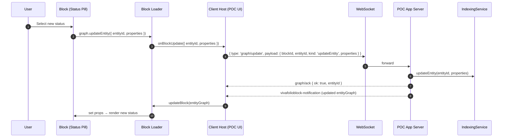

## Status Pill integration: contract and message flow

This section documents the concrete integration of the Status Pill block across the components (Block → Loader → Client Host → Server → IndexingService), including how status options are sourced from `blocks/status-pill/statusOptionsConfig.json`.

### Roles and contracts

- Block (Status Pill)
   - Implements a SolidJS custom element exported via a factory that returns `{ element, init, updateEntity }`.
   - Contract: may call `graph.updateEntity({ entityId, properties })` to request updates. It does not perform I/O.
   - Optimistic UI: immediately reflects the chosen status while awaiting confirmation.
   - Status options: derives labels/colors from the config entity referenced by `statusOptionsEntityId` (see “Testing hooks and guarantees” below).
   - Safety: unknown `status` values are clamped to the configured options.

- Vivafolio Block Loader
   - Loads the block bundle and detects custom-element factory; wires a property-only `updateEntity(properties)` callback that calls host `onBlockUpdate({ entityId, properties })`.
   - Contract: does not send network messages; it’s a pure bridge between block and host.

- Block Builder & Dev Server (port 3001)
   - Builds/serves block bundles and hot-reload signals. No graph updates or persistence.

- Client Host (POC web app)
   - Renders blocks using the Block Loader and provides `onBlockUpdate`.
   - On block update, sends a WebSocket message to the app server:
      - Outgoing envelope: `{ type: 'graph/update', payload: { blockId, entityId, kind: 'updateEntity', properties } }`.
   - Reliability extras:
      - Maintains a small send queue if WS not yet open.
      - Dedupes identical updates for a short TTL to avoid double sends when multiple paths fire.

- POC Application Server (apps/blockprotocol-poc)
   - Receives `graph/update` over WS; logs and delegates to IndexingService:
      - `indexingService.updateEntity(entityId, properties)`.
   - Reflects the update in scenario state (legacy fallback) and dispatches a fresh `vivafolioblock-notification`.
   - Sends `graph/ack` after persistence.

- IndexingService
   - Owns entity metadata, file watching, and editing modules (CSV/Markdown/DSL).
   - Persists updates (e.g., `apps/blockprotocol-poc/data/tasks.csv`) and emits events (`file-changed`, `entity-updated`, etc.) consumed by the sidecar LSP and broadcaster.

### Message flow diagram

Notes:
- Status changes are persisted by IndexingService (e.g., to `apps/blockprotocol-poc/data/tasks.csv`).

### End-to-end flow (status change)

1) User selects a new status in the block UI.
2) Block calls `graph.updateEntity({ entityId: 'status-pill-entity', properties: { ... , status: '<next>' } })`.
3) Loader invokes host `onBlockUpdate` → Client Host sends WS `{ type: 'graph/update', payload: ... }`.
4) Server receives `graph/update`, invokes `indexingService.updateEntity(...)`.
   - Server also maintains scenario state as a legacy fallback and rebroadcasts notifications.
5) Server broadcasts a fresh `vivafolioblock-notification` and sends `graph/ack`.
6) Client Host reuses the existing loader instance (`updateBlock`) so the pill stays put and updates to the new status.
7) Tests wait for `graph/ack` and/or `vivafolioblock-notification`, and may verify persistence via file contents.

### Payload shapes and events

- Block → Loader bridge (properties-only): `{ status: 'blocked' }`.
- Client Host → Server WS: `{ type: 'graph/update', payload: { blockId, entityId, kind: 'updateEntity', properties } }`.
- Server → Client events:
   - `vivafolioblock-notification`: carries the updated `entityGraph` and resources.
   - `graph/ack`: `{ entityId, properties, ok }`.

### Testing hooks and guarantees

- Deterministic scenario boot: the server hydrates a task row from `apps/blockprotocol-poc/data/tasks.csv` and a status config entity from `blocks/status-pill/statusOptionsConfig.json`.
- The task row entity includes `statusOptionsEntityId` pointing at the config entity; the Status Pill derives labels/colors exclusively from that entity’s `availableStatuses`.
- After a change, tests should wait for the refreshed `vivafolioblock-notification` (and/or `graph/ack`) rather than polling files.
- UI stability is ensured by:
   - Loader reuse (`updateBlock`) to prevent disappearing/duplicated pills.
   - Optimistic status in the block UI to avoid stale text between WS send and server notification.

### Future cleanup

- Migrate remaining scenario-specific `applyUpdate` code paths to be fully IndexingService-driven.
