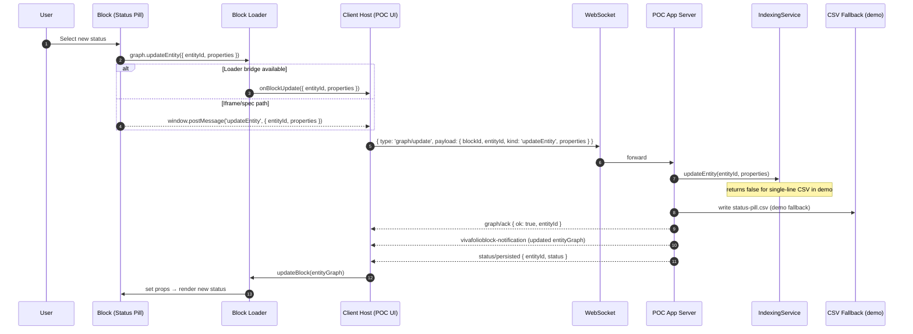

## Status Pill integration: contract and message flow

This section documents the concrete integration of the Status Pill block across the components (Block → Loader → Client Host → Server → IndexingService), including the demo’s CSV persistence.

### Roles and contracts

- Block (Status Pill)
   - Implements a SolidJS custom element exported via a factory that returns `{ element, init, updateEntity }`.
   - Contract: may call `graph.updateEntity({ entityId, properties })` to request updates. It does not perform I/O.
   - Optimistic UI: immediately reflects the chosen status while awaiting confirmation.
   - Safety bridge: besides the loader bridge, also posts a spec-style `window.postMessage({ type: 'updateEntity', blockId, data: { entityId, properties } })` for iframe/host listeners. This is narrow and only for dev/demo.

- Vivafolio Block Loader
   - Loads the block bundle and detects custom-element factory; wires a property-only `updateEntity(properties)` callback that calls host `onBlockUpdate({ entityId, properties })`.
   - Contract: does not send network messages; it’s a pure bridge between block and host.

- Block Builder & Dev Server (port 3001)
   - Builds/serves block bundles and hot-reload signals. No graph updates or persistence.

- Client Host (POC web app)
   - Renders blocks using the Block Loader and provides `onBlockUpdate`.
   - On block update, sends a WebSocket message to the app server:
      - Outgoing envelope: `{ type: 'graph/update', payload: { blockId, entityId, kind: 'updateEntity', properties } }`.
   - Reliability extras:
      - Maintains a small send queue if WS not yet open.
      - Dedupes identical updates for a short TTL to avoid double sends when multiple paths fire.
   - Also listens to `window.postMessage('updateEntity')` to support iframe/spec-style blocks; it funnels these into the same WS path.

- POC Application Server (apps/blockprotocol-poc)
   - Receives `graph/update` over WS; logs and delegates to IndexingService:
      - `indexingService.updateEntity(entityId, properties)`.
   - Updates in-memory scenario state and dispatches fresh `vivafolioblock-notification` reflecting the change.
   - Sends `graph/ack` and a domain-specific `status/persisted` event for the demo (useful in tests).
   - Demo CSV fallback: the IndexingService’s CSV module expects headered, row-based CSVs. The status-pill demo uses a single-line CSV of a human label (e.g., "To Do"). Until a dedicated editing module exists, the server writes the CSV directly when the scenario is `status-pill-example` and the entity is `status-pill-entity`.

- IndexingService
   - Owns entity metadata, file watching, and editing modules (CSV/Markdown/DSL). In this demo, it cannot update the single-line CSV and returns `false`; the server’s narrow fallback persists the value.
   - Emits events (`file-changed`, `entity-updated`, etc.) consumed by the sidecar LSP and broadcaster.

### Message flow diagram

Notes:
- The CSV write is demo-only until a proper single-value CSV editing module exists in IndexingService.
- Either the Loader bridge or the iframe `postMessage` path is used; both converge on the same WS payload.

### End-to-end flow (status change)

1) User selects a new status in the block UI.
2) Block calls `graph.updateEntity({ entityId: 'status-pill-entity', properties: { ... , status: '<next>' } })`.
3) Loader invokes host `onBlockUpdate` → Client Host sends WS `{ type: 'graph/update', payload: ... }`.
    - If the loader bridge is absent (e.g., iframe), the block’s `window.postMessage('updateEntity', ...)` is handled by the host, which then sends the same WS payload.
4) Server receives `graph/update`, invokes `indexingService.updateEntity(...)`.
    - For the demo, it also writes the single-line CSV via a small fallback and updates scenario state.
5) Server broadcasts a fresh `vivafolioblock-notification` and sends `graph/ack` and `status/persisted`.
6) Client Host reuses the existing loader instance (`updateBlock`) so the pill stays put and updates to the new status.
7) Tests poll the CSV and/or wait for `status/persisted` to confirm persistence.

### Payload shapes and events

- Block → Loader bridge (properties-only): `{ status: 'blocked' }`.
- Client Host → Server WS: `{ type: 'graph/update', payload: { blockId, entityId, kind: 'updateEntity', properties } }`.
- Server → Client events:
   - `vivafolioblock-notification`: carries the updated `entityGraph` and resources.
   - `graph/ack`: `{ entityId, properties, ok }`.
   - `status/persisted`: `{ entityId, status }` (demo convenience signal).

### Testing hooks and guarantees

- Deterministic scenario boot: the server reads `apps/blockprotocol-poc/data/status-pill.csv` at connect and seeds the entity’s `properties.status`.
- After a change, tests can either:
   - wait for `status/persisted`, or
   - poll the CSV file for the expected human label (e.g., "Blocked").
- UI stability is ensured by:
   - Loader reuse (`updateBlock`) to prevent disappearing/duplicated pills.
   - Optimistic status in the block UI to avoid stale text between WS send and server notification.

### Future cleanup

- Replace the demo CSV fallback with a proper `SingleValueCsvEditingModule` registered in IndexingService, or convert the CSV to a headered format (`status-pill-row-0`) so the existing CSV module can update it.
- Optionally drop the `window.postMessage('updateEntity')` path once all blocks use the loader bridge consistently.
