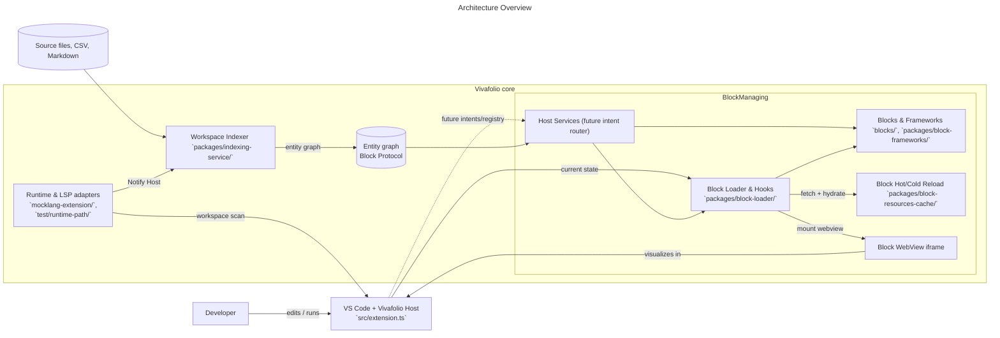
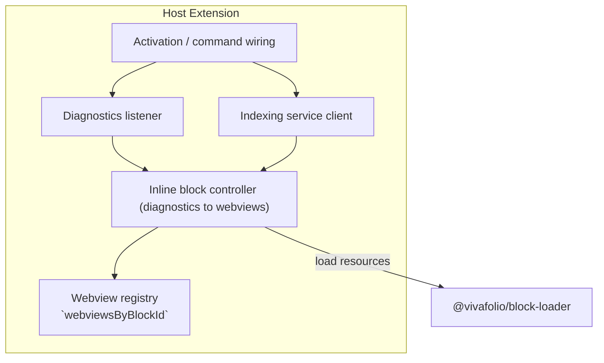
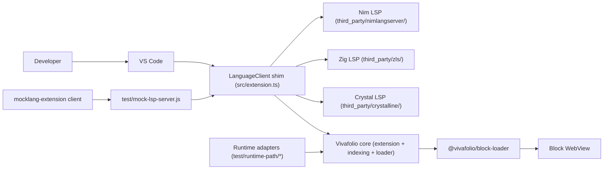
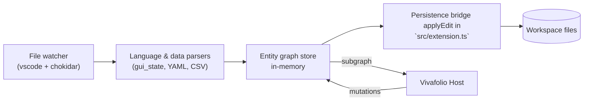
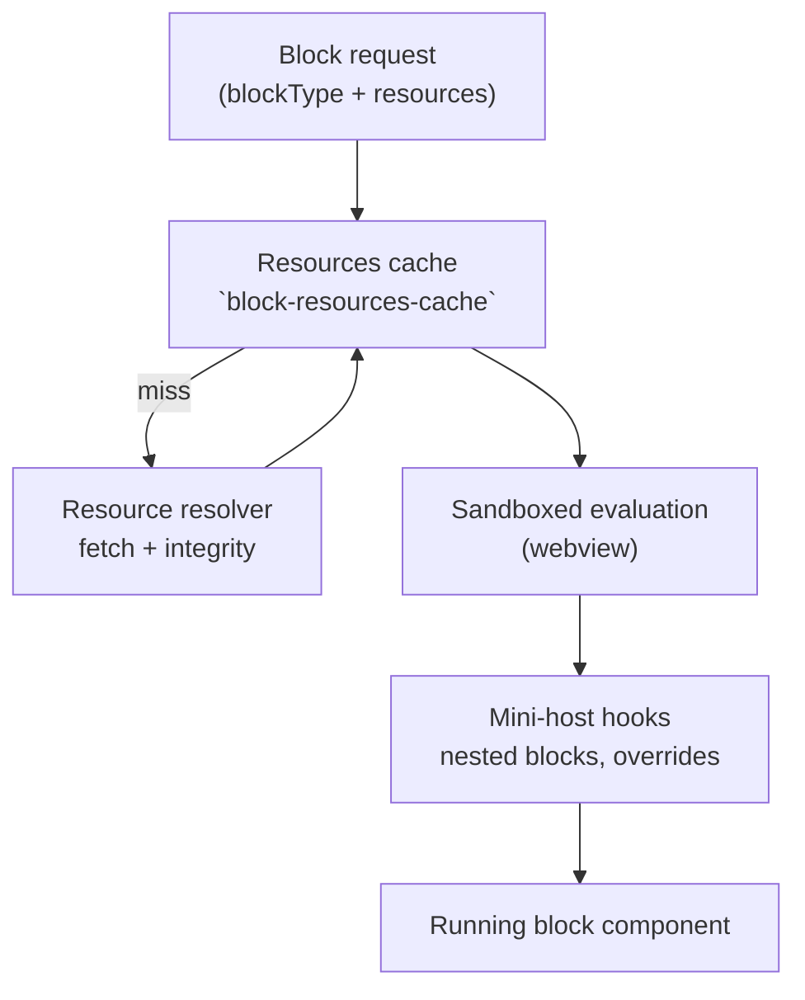
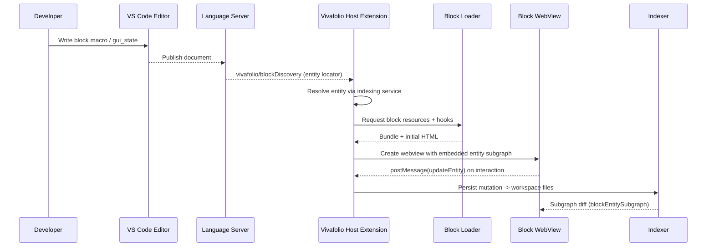
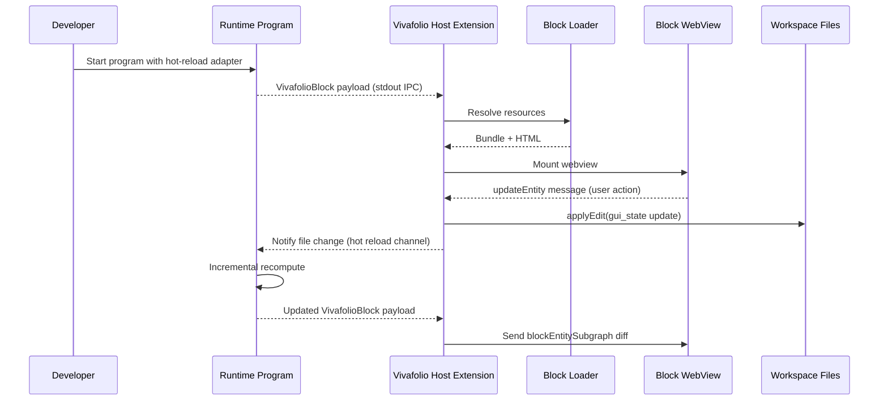
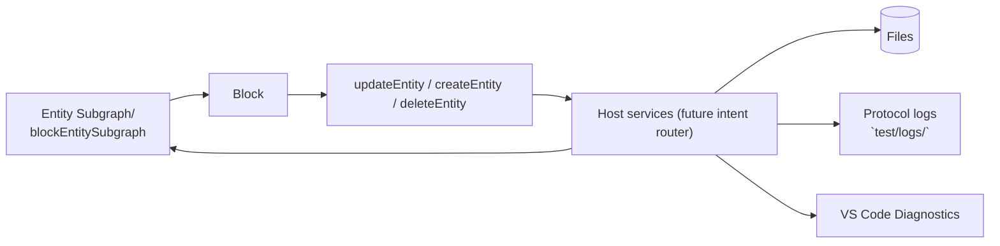

# Vivafolio Architecture Guide

**Audience:** Developers and contributors who need a concise but comprehensive view of how Vivafolio is structured, how the major services interact, and where to look in the codebase for implementation details.

**Related specs:** This guide complements `docs/spec/Vivafolio-Overview.md` (high-level philosophy) and `docs/spec/BlockProtocol-in-Vivafolio.md` (deep Block Protocol contract).

## 1. Platform at a Glance

Vivafolio extends Visual Studio Code to render interactive Block Protocol components inline with source code. The system is layered so that language integrations, runtime adapters, and block implementations can evolve independently.

### Key layers

| Layer | Responsibilities | Implementation anchors |
| --- | --- | --- |
| Host extension | Activates commands, manages webviews, mediates protocol messages. | `src/extension.ts` |
| Workspace indexer | Builds the in-memory entity graph from source files & structured data. | `packages/indexing-service/src/index.ts` |
| Block loader | Resolve, cache, and hydrate block bundles; provide hooks for nested blocks. | `packages/block-loader/src/BlockLoader.ts`, `packages/block-loader/src/hooks.ts`, `packages/block-resources-cache/src/index.ts` |
| Blocks & frameworks | Concrete block implementations plus framework adapters. | `blocks/*`, `packages/block-frameworks/*` |
| Runtime/LSP adapters | Surface block discovery events from languages or runtime programs. | `mocklang-extension/src/extension.ts`, `test/runtime-path/python/two_blocks.py` |
| Host services (future) | Intent routing, service-provider registry, workflow orchestration. | Planned per `docs/spec/Vivafolio-Overview.md` & `docs/spec/BlockProtocol-in-Vivafolio.md` |
| Auxiliary apps & tests | Validate architecture with end-to-end flows. | `apps/blockprotocol-poc/`, `test/scenarios/*.js` |

### Vivafolio Core (today)

- `src/extension.ts:1` bootstraps the VS Code contribution, wires diagnostics, and owns the long-lived `webviewsByBlockId` registry that tracks every inset/panel instance created from Hint diagnostics.
- `src/extension.ts:48` initializes the in-process services (`@vivafolio/indexing-service`, `@vivafolio/block-resources-cache`, and `@vivafolio/block-loader`) so the host can resolve block bundles deterministically from workspace files.
- `packages/block-loader/src/BlockLoader.ts:1` and `packages/block-loader/src/hooks.ts:1` provide the React/mini-host runtime that blocks use to fetch resources, hydrate entity graphs, and embed nested blocks.
- `packages/block-resources-cache` and `packages/indexing-service` form the rest of the core runtime: they keep deterministic graphs in memory and guarantee bundle integrity before anything reaches a webview.
- Future **Host Services** live only in the specs today (`docs/spec/Vivafolio-Overview.md:172`, `docs/spec/BlockProtocol-in-Vivafolio.md:282`); the dashed edges in the diagrams highlight where that intent router will eventually sit once implemented.

## 2. Host Extension Internals

The host extension orchestrates indexing, block discovery, and webview lifecycle management.

**Responsibilities**

- **Activation:** registers commands (e.g. `vivafolio.editBlock`), kicks off diagnostics watches, and primes services.
- **Diagnostics listener:** watches for block discovery notifications (LSP or runtime) and normalizes payloads.
- **Indexing service client:** requests entity subgraphs and pushes mutations back to disk using `@vivafolio/indexing-service`.
- **Inline block controller:** lives in `src/extension.ts`, coordinates `@vivafolio/block-loader`, assembles initial HTML with embedded entity data, and routes messages.
- **Webview registry:** tracks active inset/panel instances (via `webviewsByBlockId`) so updates, disposal, and logging stay consistent.

## 3. Language Support & Testing Stack

### 3.1 Language support libraries

- CTFE languages piggyback on the vendored LSP implementations inside `third_party/` (see `README.md:102`), which the Justfile knows how to build via `just build-nimlangserver`, `just build-zls`, and `just build-crystalline`.
- The VS Code extension consumes those servers through `vscode-languageclient` (`src/extension.ts:1`), so any language that emits Vivafolio-formatted diagnostics immediately plugs into the host runtime.
- Runtime-oriented helpers live alongside the tests; the Python/Ruby/Julia/R/Node helpers in `test/runtime-path/` provide the glue for languages that emit `VivafolioBlock` payloads over stdout instead of LSP notifications (`test/runtime-path/README.md:1`).

### 3.2 Mock + runtime adapters

- The `mocklang-extension` ships a dedicate test-only language client that launches `test/mock-lsp-server.js` whenever `.viv` files open (`mocklang-extension/README.md:1-18`). This isolates E2E plumbing from the production extension and keeps mock traffic behind a separate activation event.
- `test/mock-lsp-server.js:1-80` implements the fake Language Server: it speaks JSON-RPC, fabricates diagnostics with embedded Block Protocol payloads, and exercises the same discovery path as real servers.
- Runtime execution goes through `executeRuntimeFile` in the extension (`src/extension.ts:962-1019`), which spawns the appropriate interpreter, reads JSON-line payloads, and reuses the diagnostic pipeline so runtime languages get the same reactive behavior as compile-time ones.

### 3.3 Language + runtime flow

### 3.4 Testing & validation tooling

- The mock-language stack above is exercised both directly and via full protocol runs: `Justfile:323-335` wires `test-lsp-direct`, `test-lsp-protocol`, and `test-lsp-syntax-errors` so we can validate the mock server in isolation before hitting VS Code.
- Scenario runners inside `test/scenarios/basic-comms.js:1-80` spin up real LSP binaries, capture logs under `test/logs/`, and assert that every language publishes usable diagnostics.
- WDIO suites such as `test/wdio/specs/two-blocks-interaction.e2e.ts:1-80` launch VS Code itself, open sample projects, and drive insets through the webview context—these are the “isolated testers” the boss mentioned because they keep per-test copies of source files and webviews.
- Playwright coverage in `apps/blockprotocol-poc/tests/hello-block.spec.ts:30-80` ensures the shared block runtime behaves correctly even outside VS Code, while the runtime-path programs listed in `test/runtime-path/README.md:1-60` validate the stdout-driven execution path.

## 4. Component Deep Dives

### 4.1 Workspace Indexer

- Watches workspace files, parses gui_state blocks, Markdown frontmatter, CSV tables.
- Maintains deterministic entity IDs per file (`file://path#range`).
- Serves GraphQL-like queries for subgraphs used to hydrate blocks.
- Mutations persist changes back to files and trigger editor updates via `vscode.workspace.applyEdit`.

Code path: `packages/indexing-service/src/index.ts`, `packages/indexing-service/src/workspaceGraph.ts`.

### 4.2 Block Loader Stack

The loader resolves block resources, instantiates sandboxed runtimes, and surfaces React/Vue/Svelte adapters.

- `packages/block-loader/src/BlockLoader.ts` orchestrates fetch + evaluation.
- `packages/block-resources-cache/src/index.ts` memoizes bundles, enforces hash integrity.
- `packages/block-loader/src/hooks.ts` exposes host-aware hooks for nested blocks, tested via `apps/blockprotocol-poc/tests/`.
- Framework adapters live in `packages/block-frameworks/*`, providing `BlockProtocolClient` bindings.

### 4.3 Block Implementations

- Local development blocks in `blocks/*` (e.g. `blocks/table-view-tanstack/README.md`).
- Published bundles exercised through the Block Protocol POC (`apps/blockprotocol-poc/src/server.ts`, `apps/blockprotocol-poc/src/client/main.ts`).
- Test scaffolding validates block lifecycle via Playwright (`test/scenarios/basic-comms.js`) and VS Code UI automation (`test/wdio/README.md`).

### 4.4 Runtime & LSP Adapters

- Mock language extension (`mocklang-extension/src/extension.ts`) simulates diagnostic-driven discovery.
- Runtime-path adapters (Python, Ruby, Julia, R, Node) emit `VivafolioBlock` payloads as JSON lines: see `test/runtime-path/python/two_blocks.py`.
- Handlers normalize both compile-time (LSP) and runtime events to the same block manager API.

## 5. Interaction Flows

### 5.1 Compile-Time (LSP) Path

### 5.2 Runtime Hot-Reload Path

## 6. Data & Logging

- **Entity Graph:** Central source of truth managed by `@vivafolio/indexing-service`; enriched with host metadata (`sourceUri`, `readonly`).
- **Protocol Logging:** Each block session writes LSP traffic and block protocol messages to `test/logs/`.
- **Resource Integrity:** Bundles hashed prior to execution; digests exposed via diagnostics (`apps/blockprotocol-poc/src/server.ts:1`).

## 7. How to Explore Further

- Browse the extension entry point at `src/extension.ts` to follow activation, command wiring, and dependency injection.
- Inspect the block loader lifecycle in `packages/block-loader/src/BlockLoader.ts`, especially the sandbox creation logic.
- Review the indexing pipeline in `packages/indexing-service/src/index.ts` to understand how file mutations propagate.
- Run the Block Protocol POC (`just test-blockprotocol-poc`) to see the full architecture exercised end-to-end (`apps/blockprotocol-poc/tests/hello-block.spec.ts:40`).

This document should serve as a starting point for newcomers and a quick refresher for maintainers who need to reason about the relationships between Vivafolio’s subsystems.
